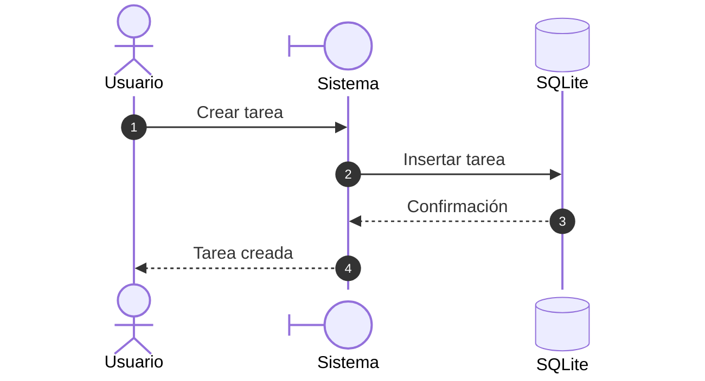
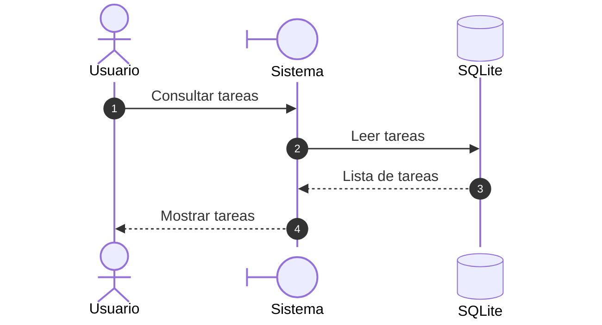
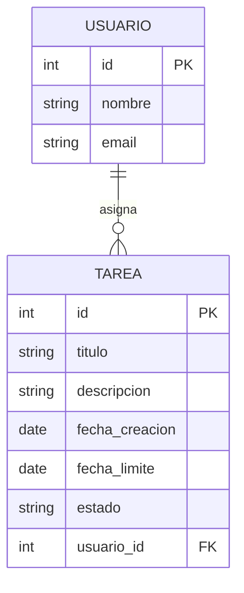
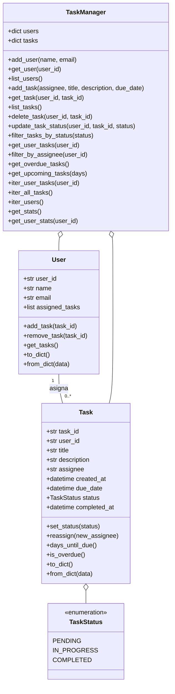

# Sistema de Gestión de Tareas

Este es un proyecto académico hecho en Python para gestionar tareas y usuarios en una empresa de software.

## Diagramas de diseño

### Casos de Uso




---


### Entidades



---


### Solución


## ¿Cómo lo uso?

1. **Crea un entorno virtual (recomendado):**

```bash
python3 -m venv venv
source venv/bin/activate
```

2. **Instala las dependencias:**

```bash
pip install -r requirements.txt
```

3. **Ejecuta la demo básica:**

```bash
python3 demo.py
```

Esto crea usuarios, tareas, actualiza estados y guarda los datos.

4. **Ejecuta el ejemplo avanzado:**

```bash
python3 advanced_example.py
```

Aquí verás generadores, iteradores y más cosas de Python.

5. **Corre las pruebas (recomendado):**

```bash
pytest
```
